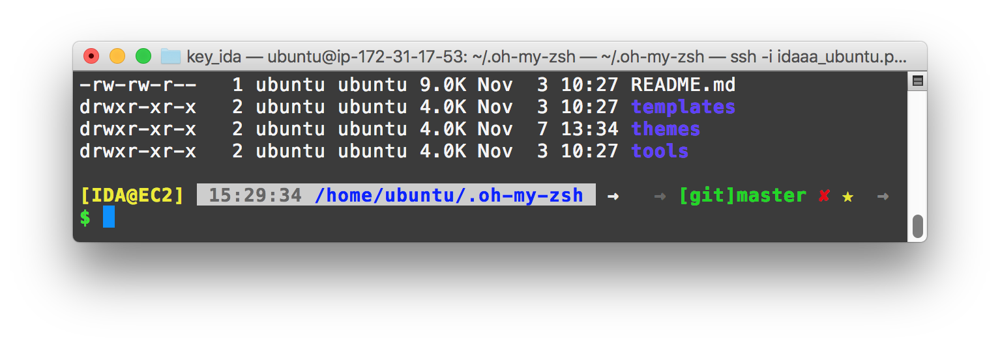
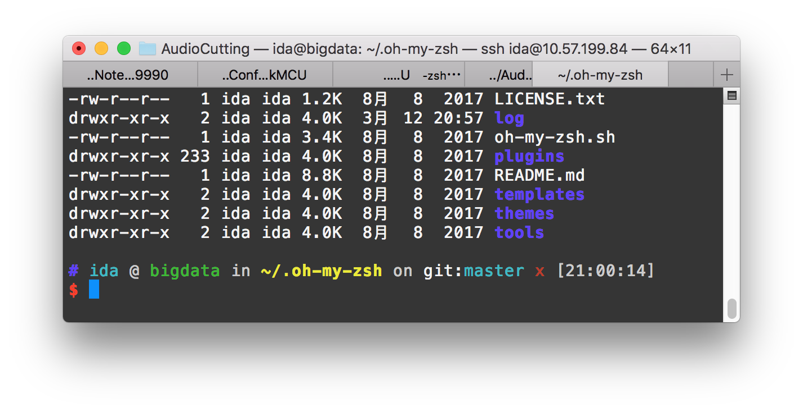
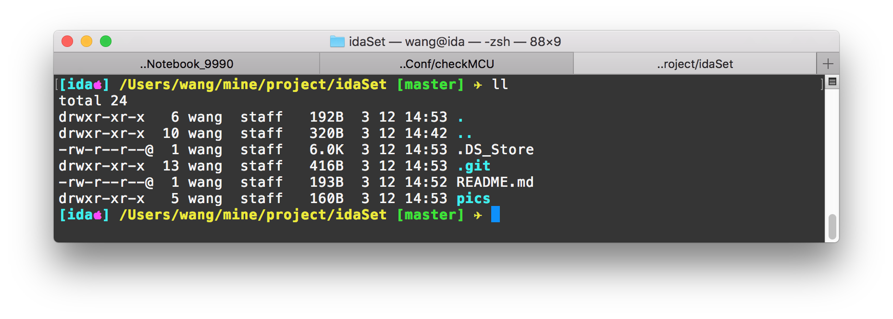

# <center>idaSet</center>
<center>Init my env, about zsh and vim settings</center>


> [time=Mon, 20170312]

## ZSH Themes

### ida_bullet-train.zsh-theme
- Modify from bullet-train.zsh
- 

### ys.zsh-theme_ida
- Modify from ys.zsh-theme
- 

### IDA theme
- Modify from cloud.zsh-theme 
- add an apple
- 


## VIM Setting
- path : 
	- /usr/share/vim/vimrc

```bash
set nu
syntax on
set cindent
set cursorline
colorscheme koehler
set nocompatible
```